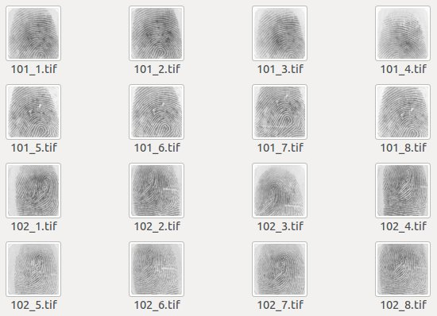

pgafis
======

pgAFIS - Automated Fingerprint Identification System Support for PostgreSQL



# Sample fingerprints data

```sql
afis=#
SELECT id, arq, xyt FROM dedos;

 id |    arq    |      xyt       
----+-----------+----------------
  1 | 101_1.xyt | 45 62 5 72    +
    |           | 56 280 118 17 +
    |           | 73 71 95 78 ...
  2 | 101_2.xyt | 18 39 5 15    +
    |           | 32 257 118 82 +
    |           | 44 47 95 67 ...
(...)
```
- "xyt" column holds fingerprint templates in XYT format


# Verification (1:1)

```sql
afis=#
SELECT (bz_match(a.xyt, b.xyt) >= 30) AS match
FROM dedos a, dedos b
WHERE a.id = 1 AND b.id = 6;

 match 
-------
 t
(1 row)
```
- given two fingerprints, they can be considered the same according to a stated threshold value (e.g., 30)


# Identification (1:N)

```sql
afis=#
SELECT a.arq AS arq1, b.arq AS arq2,
  bz_match(a.xyt, b.xyt) AS match
FROM dedos a, dedos b
WHERE a.id = 1
  AND bz_match(a.xyt, b.xyt) > 20
LIMIT 3;

   arq1    |   arq2    | match 
-----------+-----------+-------
 101_1.xyt | 101_1.xyt |   144
 101_1.xyt | 101_2.xyt |    24
 101_1.xyt | 101_6.xyt |    40
(3 rows)
```
- sequential scan is made on the table, but so far as a given number of templates (e.g, 3) above the defined threshold (e.g, 20) is reached
